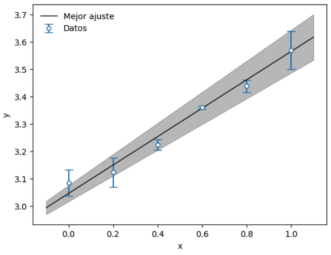

# Lecture Notes. Introduction to Numerical Method:

In this repository, I present a set of Jupyter notebooks (in Spanish language) that I used in the Numerical Methods lectures   January-August 2024, DCI-UGTO.

# FOLDERS:
- [Lectures](Lectures/README.md)
- [Books: literature bibliograpy](Books/README.md)
- Module: This folder contains a module made with the different routines seen in the course.
- Ejercicios: This folder contains the homeworks.
- Examenes: This folder contains the different exams and their answers (in Spanish).
- Memo: This folder contains the course memo.

# BLOQUES:
- [Bloque Cero](Lectures/Bloque_Cero/README.md)
- [Bloque Uno](Lectures/Primer_Bloque/README.md)

# Wolfram Mathematica
Durante el curso se verán algunas implementaciones en Wolfram Mathematica para un curso introductorio consultar: [An Elementary Introduction to the Wolfram Language](https://www.wolfram.com/language/elementary-introduction/3rd-ed/)